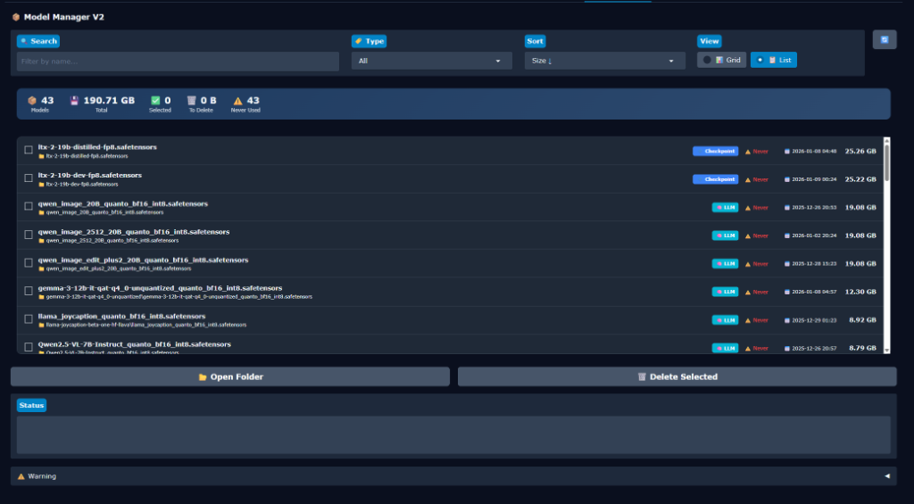

# Wan2GP Model Manager

A plugin for [Wan2GP](https://github.com/deepbeepmeep/Wan2GP) to manage installed `.safetensors` models.



## Features

- 📦 **View all models** - Scan and display all installed model files (`.safetensors`, `.sft`, `.pth`, `.pt`, `.ckpt`)
- 📊 **Size information** - See file sizes in human-readable format (GB/MB)
- 🏷️ **Auto-detect type** - Automatically categorize models: LoRA, Checkpoint, VAE, Text Encoder, LLM, Upscaler, Depth, Audio, etc.
- 🔍 **Search** - Filter models by filename
- 🏷️ **Filter by type** - Show only specific model types
- 📊 **Two view modes** - Grid view (compact) or List view (detailed)
- 📈 **Usage tracking** - Track how many times each model was used and when
- ⚠️ **Never Used indicator** - Easily identify unused models
- 📂 **Open folder** - Open model location in file explorer
- 🗑️ **Delete models** - Remove selected models to free up disk space
- 📉 **Statistics** - View total models count, total size, selected size

## Installation

1. Clone this repository into your Wan2GP plugins folder:
   ```bash
   cd /path/to/Wan2GP/plugins
   git clone https://github.com/YOUR_USERNAME/wan2gp-model-manager.git
   ```

2. Restart Wan2GP

3. Go to the **Plugins** tab, enable **Model Manager**, and save settings

4. Restart Wan2GP again

5. The **Model Manager** tab will appear in the interface

## Usage

1. Click **🔄** to refresh the model list
2. Use **Search** to filter by filename
3. Use **Type** dropdown to filter by model type
4. Toggle between **📊 Grid** and **📋 List** views
5. Select models you want to delete
6. Click **🗑️ Delete Selected** to remove them

> ⚠️ **Warning**: Deletion is permanent! Files do NOT go to the recycle bin.

## Detected Model Types

| Type | Icon | Color | Examples |
|------|------|-------|----------|
| LoRA | 🎨 | Green | Files in `loras/` folder or with "lora" in name |
| Checkpoint | 🔷 | Blue | Main diffusion models (>5GB) |
| VAE | 🎭 | Purple | Variational AutoEncoder models |
| Text Encoder | 📝 | Orange | CLIP, T5, UMT5, XLM-RoBERTa |
| LLM | 🧠 | Cyan | Qwen, Llama, Gemma, JoyCaption |
| Upscaler | ⬆️ | Pink | ESRGAN, SwinIR, FlashVSR |
| Depth | 🌊 | Purple | Depth Anything, MiDaS |
| Audio | 🔊 | Yellow | MMAudio, wav2vec, Roformer |
| Segmentation | ✂️ | Lime | SAM, RemBG |

## Requirements

- [Wan2GP](https://github.com/deepbeepmeep/Wan2GP) with plugin support
- Python 3.10+

## License

MIT License
